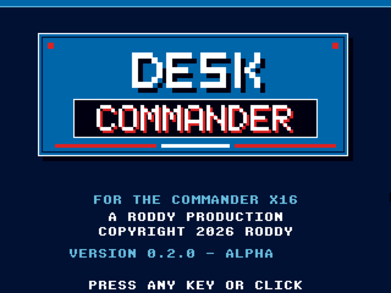
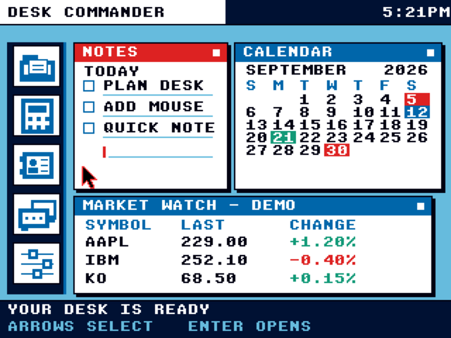
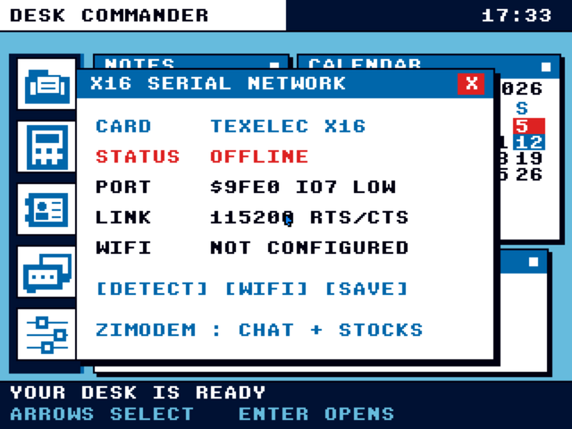

# 🖥️ DESK COMMANDER

> A friendly, DeskMate-inspired personal desktop for the Commander X16.



DESK COMMANDER is an original retro organizer written in readable
[Prog8](https://prog8.readthedocs.io/) for the Commander X16. It combines
Notes, Calendar, Rolodex, Files, Calculator, Settings, Comms, and Market Watch
inside a crisp mouse-and-keyboard desktop.

> [!IMPORTANT]
> This is **version 0.3.0 alpha**. Several screens are working prototypes and
> persistence still needs power-loss hardening. The application now boots and
> runs on a physical Commander X16, but completing the ZiModem connection is
> the top-priority defect. See the [V1 roadmap](ROADMAP.md) for the complete,
> honest list of unfinished work.

## ✨ Current highlights

- 🖱️ Hardware mouse support with small blue, large red, and normal black pointers
- ⌨️ Arrow-key desktop selection with `Enter` to launch
- 🕐 Live RTC clock with working 12/24-hour formats
- 📝 Six saved Notes with Add, Delete, wheel/arrow scrolling, and a scrollbar
- 📅 Month navigation and 24 saved, editable, color-coded Calendar events
- 📇 Searchable, scrollable Rolodex with phone, email, and social fields
- 🧮 Functional mouse-and-keyboard Calculator
- 📁 Real device-8 File Manager with distinct file/folder icons, New File,
  New Folder, Open, Rename, Move, paging, and confirmed Delete
- ✍️ Text Editor ++ with multiline editing, mouse placement, Save, Save As,
  dirty-file warnings, and a clean return to the File Manager
- 🎨 X16, Amber, and Night theme packages
- 🔊 Subtle optional interface sounds
- 💬 Full-screen Comms with saved user/host settings, persistent offline
  friends, group chats, inline 32-character composition, scrollable history,
  online/away/offline colors, and two-way internet messages
- 📈 Saved twelve-symbol Market Watch, defaulting to GOOG, MSFT, and TSLA
- 📡 Physical TexElec UART detection at `$9FE0`; ZiModem communication is the
  current top-priority hardware issue
- ⚡ Dirty-region redraws that reduce flashing while lists and documents scroll

## 🖼️ Screenshots

| Desktop | TexElec network setup |
|---|---|
|  |  |

The Network screen is designed for the
[TexElec Commander X16 921.6Kbps Serial & ESP32 Network Card](https://texelec.com/product/commander-x16-serial-network-card/).
It reflects the card's preinstalled
[ZiModem](https://github.com/bozimmerman/Zimodem) interface, default IO7-low
network UART at `$9FE0`, 115200 baud, and RTS/CTS flow control. On physical
hardware, DESK COMMANDER successfully detects the card's UART at `$9FE0` and
has now received both `OK` and the full ZiModem ESP32 Firmware v4.0.2 startup
banner. The current build treats the successful ZiModem-specific setup reply
as readiness; its optional firmware query can no longer incorrectly disable
Scan and Join merely because the banner ends in `READY` instead of `OK`. A
cold-start banner also triggers an automatic settled retry, replacing the
previous need to press Detect twice.
Wi-Fi scanning, joining, status, and Market Watch still require confirmation
with this build on the physical card.

## 🚧 Road to 100%

The complete task breakdown lives in the [V1 roadmap](ROADMAP.md). Work should
proceed in this order:

- [x] **P0 — Establish physical ZiModem communication.** Detect, scan, join,
  IP status, reconnect/disconnect, and the outbound connection test now work on
  the real TexElec card. Per-service HTTPS parsing remains part of P2.
- [ ] **P1 — Make persistence power-loss safe.** Use temporary and backup state
  files, handle full/removed/write-protected media, and prove recovery on SD.
- [ ] **P1 — Finish the organizer.** Add long Notes, editable Contacts,
  multi-event Calendar days, tasks, recurrence, reminders, and RTC-based Today.
- [ ] **P1 — Finish keyboard and field behavior.** Add universal focus,
  consistent navigation, reusable text editing, and polished error dialogs.
- [ ] **P2 — Finish Files and Text Editor ++.** Add Copy, destination browsing,
  Find, clipboard, Undo, larger documents, and safer replacement writes.
- [ ] **P2 — Complete connected apps.** Harden Finnhub refreshes and replace the
  Comms mockup with one documented, working messaging service.
- [ ] **P2 — Release hardening.** Remove default demo records, complete licenses
  and manuals, run long hardware tests, and publish a reproducible V1 archive.

## 🚀 Run it

From the project directory:

```bash
./run.sh
```

The first run downloads the pinned development tools into `.tools/`; it does
not install anything system-wide. Later runs rebuild changed source files and
launch the emulator directly.

On the splash screen, press any key or click. On the desktop, click an app or
use the arrow keys and press `Enter`. Press `Esc` to close the current app or
return to BASIC.

### Build without launching

```bash
# Check the Prog8 source.
make check

# Compile build/main.prg and all nine loadable components.
make

# Remove generated build files.
make clean
```

### Put it on a real Commander X16

Build a clean runtime folder:

```bash
make sdcard
```

Copy every file inside `dist/sdcard/` to one directory on a FAT32 SD card.
Do not copy a development `DCSTATE.BIN` unless you deliberately want that
profile. At the X16 BASIC prompt, enter:

```basic
LOAD "DESKCMD.PRG",8,1
RUN
```

The device number is 8 and the secondary address `1` honors the PRG's encoded
load address, matching the official [CMDR-DOS LOAD documentation](https://github.com/X16Community/x16-docs/blob/master/X16%20Reference%20-%2013%20-%20Working%20with%20CMDR-DOS.md#load).
DESK COMMANDER currently targets ROM r49. The official
[ROM r49 release notes](https://github.com/X16Community/x16-rom/releases/tag/r49)
recommend VERA 48.0.1 and SMC 48.0.0 or 47.2.3 for hardware.

For networking, use the revised TexElec card at its default IO7-low address.
The manufacturer's documentation confirms `$9FE0-$9FEF`, 115200 baud,
RTS/CTS, ZiModem, and Option Pin A high. Owners of cards purchased before
October 2024 should read TexElec's replacement notice on the
[official product page](https://texelec.com/product/commander-x16-serial-network-card/).

## 🧭 App guide

| App | What works now | Still to come |
|---|---|---|
| Notes | Six saved slots; select, type, add, delete, wheel/arrow scroll | Long-form bodies, files, clipboard, undo |
| Calendar | Browse months; add/edit/delete saved typed events; flicker-free title-field editing | Multiple daily events, agenda, recurrence, reminders |
| Rolodex | Search, flicker-reduced scroll, inspect, and persist deletions | Create/edit contacts, sorting, import/export |
| Calculator | Basic arithmetic, decimals, keyboard input | Memory keys and final edge-case testing |
| Files | Browse device 8; create files/folders; edit text; launch PRG/AUTOBOOT entries; rename, move, and confirmed delete | Copy, sorting/filtering, richer errors |
| Text Editor ++ | Open files, multiline edit, mouse cursor placement, Save, Save As, unsaved-work warning | Find, clipboard, undo, larger documents, safer replacement writes |
| Settings | Saved theme, mouse, sound, clock; Network diagnostics; About | Fix physical ZiModem response and add richer storage tools |
| Comms | Separately saved username/host, persistent friends, unified groups, presence colors, scrolling, two-way LAN messages, and browser diagnostics | Authentication, moderation, invites, background presence, internet hosting |
| Market Watch | Add/delete 12 saved symbols, quote/cache UI, and rotate groups every 30 seconds | Restore physical ZiModem transport, then validate Finnhub and add richer stale/rate-limit states |

## 🧰 Project layout

```text
src/main.p8          Program entry point
src/appmeta.p8       Version, creator, and copyright strings
src/preferences.p8   Saved sound and clock preferences plus click audio
src/theme.p8         Shared palette and theme packages
src/input.p8         Keyboard, mouse, cursor, and click-sound handling
src/font5x7.p8       Scalable splash-title font
src/splash.p8        Splash screen drawing and dismissal
src/desktop.p8       Desktop, Calculator, Settings, and overlay launchers
src/app_mailbox.p8   Shared low-memory handoff between loadable apps
src/file_manager.p8  Real CMDR-DOS browser, icons, paging, and navigation
src/file_manager_overlay.p8  Loadable high-RAM app entry point
src/file_ops.p8      New File/Folder, Rename, Move, and Delete dialogs
src/file_ops_overlay.p8      Loadable file-operation entry point
src/text_editor.p8   Text Editor ++ load, edit, save, and close behavior
src/text_editor_overlay.p8   Loadable editor entry point
src/program_launcher.p8      Safe one-way handoff to another X16 PRG
src/program_launcher_overlay.p8 Loadable launcher entry point in bank 14
src/network_driver.p8        TexElec UART and ZiModem command transport
src/network_app.p8           Detect, scan, join, status, and disconnect logic
src/network_overlay.p8       Loadable Network Setup entry point
src/network_picker_overlay.p8 Network visual-helper entry point
src/network_picker.p8        SSID dirty-region and colored icon toolbar UI
src/network_mailbox.p8       Shared scanned-SSID mailbox in golden RAM
src/market_data.p8           Shared VERA watchlist and quote cache
src/market_app.p8            Scrollable watchlist and API-key interface
src/market_overlay.p8        Loadable Market Watch interface
src/market_fetch.p8          ZiModem HTTPS and Finnhub JSON worker
src/market_fetch_overlay.p8  Loadable quote-fetch service
src/state_data.p8    Versioned shared persistent-state map
src/state_store.p8   Device-8 load/save service
src/state_overlay.p8 Loadable persistence service in bank 10
src/notes_app.p8     Saved, scrollable Notes application
src/notes_overlay.p8 Loadable Notes entry point in bank 11
src/comms_overlay.p8 Loadable Comms entry point in bank 12
src/comms_data.p8    Shared saved identity and VERA chat cache
src/chat_network.p8  ZiModem HTTP client in bank 15
src/comms_visual.p8  Comms rendering service in bank 16
server/chat_server.py Local persistent Python chat/API server
server/web/index.html Browser chat and account-management dashboard
backend/             Modular public RetroWire service (X16 first)
docs/RETROWIRE.md    Draft shared X16/Spectrum Next/C64U protocol
src/calendar_app.p8  Month view and event editor
src/rolodex_app.p8   Searchable contact-card application
src/comms_app.p8     Direct-message and server-chat prototype
docs/images/         GitHub screenshots
```

Generated files live in `build/`. `ZZFILEMAN.BIN`, `ZZFILEOPS.BIN`,
`ZZEDITOR.BIN`, `ZZLAUNCH.BIN`, `ZZNETWORK.BIN`, `ZZNETPK.BIN`, `ZZMARKET.BIN`,
`ZZMARKETNET.BIN`, `ZZSTATE.BIN`, `ZZNOTES.BIN`, `ZZCOMMS.BIN`,
`ZZCHATNET.BIN`, and `ZZCHATUI.BIN` are also
emitted beside the launcher so HostFS and an SD-card copy can load them. Keep
all thirteen beside
`main.prg`.
Downloaded tools live in `.tools/`. Generated artifacts are excluded from
source control.

Ordinary core variables live in the X16's non-banked golden RAM. The File
Manager browser uses bank 4, its operation dialogs use bank 5, and Text Editor
++ uses bank 6 plus a separate 2 KB document buffer in VERA RAM. Network Setup
uses bank 7, while bank 13 draws its scrollable SSID dirty region and compact
icon controls. Market Watch uses bank 8,
and its network worker uses bank 9. The
persistent-state service uses bank 10, Notes uses bank 11, and Comms uses bank
12. Bank 14 performs the one-way handoff to an external PRG. Comms uses bank
15 for its HTTP protocol and bank 16 for rendering. The shared 2 KB
state image—including Calendar titles and the Market cache—lives in VERA bank 1.
This keeps the core PRG safely below `$9F00` and establishes the overlay pattern
that future large apps can follow.

### File shortcuts

- File Manager: use the wheel, scrollbar, or arrows to browse; double-click or
  press `Enter`/`O` to open. Text files use Text Editor++; CMDR-DOS `PRG`
  entries (including `AUTOBOOT.X16`) close Desk Commander and run through the
  standard BASIC launcher/SYS-stub convention. `N` makes a file, `F` makes a
  folder, `R` renames, `M` moves, `D` deletes, `U` goes up, and `Esc` closes.
  Closing Files restores Desk Commander's starting directory so its app banks
  remain loadable after browsing subfolders.
- Text Editor ++: type normally, use arrows and Backspace, `F2` saves, `F4`
  opens Save As, and `Esc` closes. Unsaved documents ask whether to save or
  discard changes.
- Network Setup: `D` detects the card/ZiModem, `W` scans, `J` opens the numbered
  SSID picker, `I` refreshes IP status, and `Esc` closes. In the picker, use
  `1`-`5`, mouse clicks, arrows/mouse wheel plus Enter, or Esc. Password entry
  preserves lowercase and shifted uppercase characters. Every main action also
  has a button.

## 💬 Running the local chat server

The alpha chat server has no external Python dependencies. Run it on a computer
connected to the same LAN/Wi-Fi as the X16:

```bash
cd "/home/legion/Desktop/DESK COMMANDER"
./tools/run-chat-server.sh
```

Open `http://localhost:8088` in a browser. The **X16 Connection** panel detects
the physical LAN address and provides a **Copy IP** button. In X16 Comms,
**USER** changes and saves your username while the separate **HOST** button
changes and saves that numeric address (without `http://` or `:8088`). Both
values are written immediately to the SD card's `DCSTATE.BIN`.

Use **+FR** to save a friend. The friend does not need to be connected—or even
have opened the app yet—and appears with a red offline dot until reachable.
Green means online and yellow means away. Select a friend, click the message
field, type directly in the bottom bar, and press Return or **SEND**. The field
accepts up to 32 characters and scrolls horizontally as needed. Wheel over the
message pane—or use its up/down controls—to move one entry at a time through
the server's saved 100-message history. Offline messages remain for the next time
that friend connects.

Use **+GRP** to create a shared group chat. Select that group and use **MEM** to
add one of your saved friends. Groups replace the older duplicate “server”
room concept. Existing alpha server rooms migrate into Groups automatically.

Friends, group names/membership, and message history are persistent records in
`server/chat-data.json`; they survive X16 and server restarts and return on
**SYNC**. The browser console can remove friends or leave groups. It also shows
the last X16 request, a live API-call monitor, presence, two-way chat, and an
exact preview/byte count of the compact X16 SYNC response.

The computer and X16 must currently be on the **same non-isolated network**.
A hotel guest network address is private and normally cannot be reached from
an X16 using an iPhone hotspot. For the hardware alpha, connect the computer
to that same hotspot, allow LAN traffic in any VPN client (or disconnect the
VPN during the test), restart `DESKSVR`, and enter the newly displayed IP.

Do not expose this alpha server directly through router port forwarding or a
public IP. A real internet deployment first needs authenticated sessions,
authorization checks, TLS, abuse/rate limits, safe recovery/backups, and a
stable public host. A small public VPS is the simplest eventual fixed-IP test
host. A named Cloudflare Tunnel is another option, but it supplies a hostname
rather than a dedicated external IP and requires hostname/HTTPS support in the
X16 client. Temporary TryCloudflare tunnels are appropriate only for testing;
their generated hostname changes whenever the tunnel is restarted.

Server records are saved atomically to the ignored local file
`server/chat-data.json`. This is an intentionally simple LAN alpha: usernames
are identities, there are no passwords, encryption, moderation, or public
internet exposure protections yet. Do not port-forward port 8088.

## 🌐 Public backend foundation

The new modular service in `backend/` is the successor to the LAN test server.
Its first deployment runs on the `retrowire` Ubuntu Droplet as an unprivileged
`deskcmd` systemd service. It currently binds only to `127.0.0.1:8080`; UFW
exposes SSH only. This is intentional—no unfinished account or message endpoint
is public before RetroWire device authentication and encryption are complete.

The initial SQLite schema reserves clean modules for identity/devices, friends,
groups, chat, internal Desk Mail, games, and auditing. See
`docs/RETROWIRE.md` for the bounded encrypted transport plan and
`backend/deploy/README.md` for the server layout and health commands.

### Official public-alpha chat

The hosted RODDY master console is currently available at:

```text
https://console.143-244-168-180.sslip.io
```

The manager token is stored outside the repository at:

```text
/home/legion/.config/deskcommander/admin-token
```

Display it locally with `sed -n '1p'` and paste it into the console unlock
screen. The console can add users and permanently remove them with confirmation;
it also lists every official username, each user's friend names, all
groups/members, current presence, and live X16 calls. RODDY can initiate a
direct conversation with any account; that automatically makes RODDY visible
to the recipient so the retro client can reply. Select a group and open the
compact **GROUP TEST WINDOW** to send messages as multiple test usernames. A
test username is created and added to that group automatically, making it easy
to exercise multi-user X16 chat from one browser.

On the X16, keep **HOST** fully user-editable. Enter `143.244.168.180` to use
the official service, or another compatible IPv4 address to use a community or
private host. The official compatibility endpoint is port 8088 automatically.

For the first official-chat setup, connect the TexElec card to Wi-Fi, open
**Comms**, set **HOST** to `143.244.168.180`, set **USER** to the desired saved
username, and press **SYNC**. Then select **RODDY**, enter a message, and press
**SEND**. If RODDY is not listed yet, add `RODDY` with **+FR**, or send the user
a first message from the master console and press **SYNC** on the X16. HOST and
USER persist in `DCSTATE.BIN`, so later sessions normally only require opening
Comms. The browser console refreshes automatically. The X16 fetches the newest
messages when that friend/group is selected, immediately after **SEND**, when
**SYNC** is pressed, and automatically about every five seconds while the
newest view is open.

Port 8088 is intentionally plaintext for the present ZiModem `AT&G` client.
Use test messages only. The browser manager console uses HTTPS and a separate
manager token. Encrypted RetroWire remains the production replacement.

Market Watch writes every successful quote to `DCSTATE.BIN`. Gold, silver, and
Bitcoin compare a new quote with the last saved numeric quote—even across a
power cycle. A failed refresh now preserves that baseline instead of replacing
it with `OFFLINE`; only the very first successful quote displays `0.00%`.
- Market Watch: Add or remove up to 12 symbols. `XAU` (gold), `XAG` (silver),
  and `BTC` use the built-in keyless current-price feed. Their numeric movement
  is measured from the previous refresh. Other stock symbols
  use your own free [Finnhub](https://finnhub.io/) key entered with **KEY**.
  Select a row and choose **REFRESH** to update its group of three. Arrows or
  the wheel scroll the list. Cached groups rotate on the desktop every 30
  seconds, and the tiny circular-arrow button refreshes the visible group.
- Notes: click a visible row and type. Use the wheel or Up/Down cursor keys to
  move through all six slots. Changes are committed when Notes closes.

Market Watch sends HTTPS requests using ZiModem's `AT&G` downloader. Gold,
silver, and Bitcoin current prices come from Gold API's documented public
endpoint, which requires no authentication and requests 30-second caching.
Arbitrary equities use Finnhub; no shared Finnhub key is bundled. A user key is
masked, omitted from command echo, and stored unencrypted in `DCSTATE.BIN`, so
users should treat that SD-card file as private.
Quote availability, delay, and usage limits depend on the user's Finnhub plan
and exchange permissions; the display is informational, not trading guidance.

## 🧪 Toolchain

- Prog8 12.3.2
- 64tass 1.60.3243
- Commander X16 emulator r49
- Matching Commander X16 ROM r49
- Eclipse Temurin Java 21 runtime

Versions are pinned by `tools/setup-toolchain.sh` so a future upstream update
cannot silently change the build.

## 💾 Alpha persistence and data policy

Settings, Notes, Calendar events and view, Rolodex deletion state, the last
successful SSID/link state, Market Watch symbols/API key/cached quotes, and
other relevant preferences are stored in the versioned `DCSTATE.BIN` file on
device 8. Files edited in Text Editor ++ are naturally saved separately. Wi-Fi
passwords are deliberately never written by DESK COMMANDER.

`DCSTATE.BIN` begins with a format signature and version. A missing or invalid
alpha file produces a fresh state image. Current saves replace that file
directly; temporary-file replacement, backup recovery, full-media handling,
and physical power-loss tests remain release requirements rather than hidden
claims. Copy `DCSTATE.BIN` while Desk Commander is closed to back it up.

| Data | Alpha persistence behavior |
|---|---|
| Theme, pointer, sound, clock | Saved immediately when changed |
| Notes | Six slots of up to 21 characters; saved when Notes closes |
| Calendar | Current view and up to 24 titled events; saved when Calendar closes |
| Rolodex | Active/deleted state for the compiled sample cards |
| Network | Last SSID and last-confirmed link state; never the Wi-Fi password |
| Market Watch | Symbols, cached quotes, page, and user API key |
| Files | Saved as normal device-8 files by Text Editor ++ |
| Calculator and Comms | Deliberately temporary in the current alpha |

The current alpha includes sample notes, contacts, and events so unfinished
features are easy to evaluate. The requested Market Watch defaults are GOOG,
MSFT, and TSLA. Calculator input and mock Comms selection are intentionally
temporary because they are not user records.

The production V1 first-run experience will contain **blank personal data**.
Sample records will only appear when the user deliberately chooses a Demo Data
option.

## 🗺️ Where development goes next

The immediate priorities are power-loss-safe storage, complete keyboard focus,
finished organizer records, and physical-hardware validation of the new
TexElec/ZiModem and Market Watch paths. After that, Comms can move into its own
banked app and share a non-blocking connection service.

Read [ROADMAP.md](ROADMAP.md) for milestones, networking commands, acceptance
tests, and every known unfinished V1 area.

---

Made by **Roddy** for the Commander X16. ❤️
